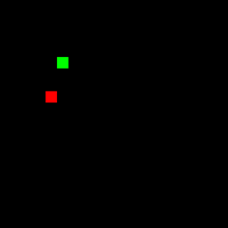

# 🤖 Reïnforcement Learning in Snake

Welkom bij de GitHub-repository over **Reïnforcement Learning (RL)** in het spel **Snake**.  
In dit project is er een RL model ontwikkeld dat in staat is om Snake te spelen.

Het project combineert een bekende en overzichtelijke spelomgeving met geavanceerde leertechnieken. Hierdoor konden we op gestructureerde wijze kennismaken met de concepten achter autonome besluitvorming en zelflerende systemen. Deze repository bevat de code, documentatie en een toelichting op de ontwerpkeuzes die we tijdens het ontwikkelproces hebben gemaakt.

## 🐍 Snake

Het spel valt binnen het genre **"Snake"**, wat is ontstaan in 1976 en bevat spellen waarbij de speler een slangachtig karakter bestuurt dat geleidelijk aan groeit. Het doel in dit genre is altijd om te voorkomen dat de slang tegen de muren of zichzelf aanbotst, terwijl je probeert zoveel mogelijk voedsel te verzamelen.

**Snake**, de populaire game uit 1998, is een bekend computerspel waarbij de speler een slang bestuurt die probeert om zoveel mogelijk voedsel te eten. Bij elke hap groeit de slang, waardoor het spel geleidelijk aan moeilijker wordt. Net als bij elk spel binnen het genre is het doel om te voorkomen dat je tegen jezelf of de muren aanbotst, terwijl je zoveel mogelijk voedsel wilt eten. Dankzij deze eenvoudige spelregels en oplopende complexiteit is **Snake**, de game, bijzonder geschikt als testomgeving voor leer- en besluitvormingsalgoritmen.

## 🎯 Waarom Reïnforcement Learning?

Reïnforcement Learning is een krachtige methode om systemen te trainen op basis van beloningen en straffen. In plaats van vooraf vast te leggen welke acties optimaal zijn, leert het model, door ervaring op te doen, welke keuzes leiden tot succes.

De spelomgeving van Snake biedt hierbij meerdere voordelen:

- 📈 **Simpele standaard beloningsstructuur**: bijvoorbeeld +1 voor voedsel, -1 bij een botsing  
- 🌍 **Dynamische omgeving**: elke actie beïnvloedt direct de toekomstige situatie  
- 🧭 **Langetermijnstrategie vereist**: de agent moet vooruitdenken om te overleven

Deze eigenschappen maken Snake tot een waardevolle omgeving om de werking van reinforcement learning in de praktijk te verkennen.

## 🎥 Voorbeeld van een simpele Snake AI

Dit voorbeeld van de Snake AI is een van onze eerste modellen. Dit model was getrained voor 1 miljoen episodes met een Q-Learning Agent en heeft verder geen aanpassingen gehad aan de reward-logica. Wat hier exact te zien is zijn de laatste 5 episodes aan training, waarbij de Snake probeert zoveel mogelijk te eten. Helaas lukt dit nog niet zo goed.
<br>
<br>
<p align="center">
  
</p>

## 📁 Projectstructuur

```plaintext
📁 Snake_RL
├── 📁 snake_env/
│   ├── 📜 SNAKE - timeframe.ipynb        
│   ├── 📜 SNAKE - head.ipynb             
│   ├── 📜 SNAKE - smaller_view.ipynb                
│   ├── 📜 manualsnek.ipynb
│   ├── 📜 SnakeRandom.ipynb
├── 📜 snake_results.ipynb                
├── 📜 LICENSE
├── 📜 README.md
├── 📜 requirements.txt
```

## 🚀 Installatie

Volg deze stappen om het project lokaal op te zetten:

1. **Clone de repository**
   ```bash
   git clone https://github.com/jasper18014445/Snake_RL.git
   cd Snake_RL
   ```

2. **Installeer de vereiste pakketten**
   ```bash
   pip install -r requirements.txt
   ```

## 🏗 Gebruik

Het is aan te raden om de code enkel via notebooks te gebruiken, gezien er geen functionaliteit is gemaakt voor het runnen van losse bestanden. Je kunt de notebooks openen en uitvoeren met Jupyter Notebook of Jupyter Lab:

```bash
jupyter notebook
```

## 📊 Geteste modellen

Voor ons onderzoek is Q-Learning en PPO gebruikt. Hoewel Q-Learning niet expliciet verder is onderzocht, is PPO gebruikt om ons uiteindelijke model te trainen. Na een langdurige training is het uiteindelijk gelukt om een score van 13 te bereiken. Hoewel dit lager was dan de scores die kwamen uit het zelf spelen van **Snake**, laat dit resultaat ook de complexiteit van het spel zijn voor Deep Reïnforcement Learning modellen.

## 📜 Licentie

Dit project is beschikbaar onder de **MIT License**. Zie [`LICENSE`](LICENSE) voor meer details.
